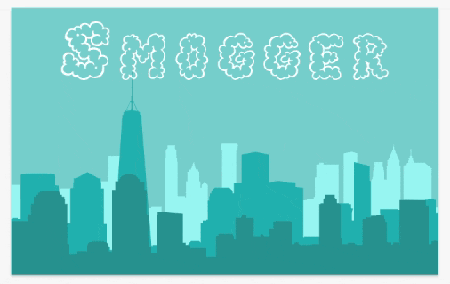
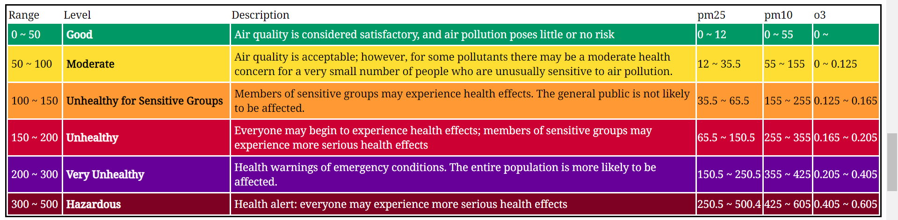

# air_quality_app
Welcome to the README for my air quality app! This is an application called SMOGHORN that I created to fetch global Air Quality Index (AQI) data. My goal for this project was to create something that was equal parts functional and aesthetically pleasing. To create this project I used vector illustration software to create the UI components, Axios.js to fetch AQI data, and then some good old HTML, CSS, and JavaScript to bring it all to life.  

This project was made possible with the help of World Air Quality Index's (WAQI) open source API:
[https://waqi.info/](https://waqi.info/)

To view the final product check out this GitHub Pages link:  
[https://paul-schultz.github.io/air_quality_app/](https://paul-schultz.github.io/air_quality_app/)

Or keep reading for a step by step breakdown of how I created SMOGHORN

AQI data uses a scale of colors to communicate how hazardous the current AQI value is. So I thought it would be cool to have the background of the application be a cityscape that would change colors dependent on the AQI value returned for the requested city. The following gif shows the initial mockup of the cityscape in the vector illustration software, with blue being the initial color of the city on load before any data is requested. 

After exporting the UI assets as .svg files, I created some vector art clouds to go with the buildings. First I rebuilt my UI mockup in the browser with CSS, making sure to layer the buildings in the right order with z-indexing. After the buildings were squared away I imported .svg's of the clouds used @keyframes to have them glide in between the buildings. This added some depth and a little bit of realism to the design. I was happy with how it turned out.  

The next step was adding functionality to my UI using HTML and JavaScript. I used the Axios.js library to make GET requests to WAQI's API. If the request is successful a window appears that displays the name of the city, the current AQI, the air pollution level, health implications, the EPA AQI description, a forecast of the average AQI for the next three days, and the equivalent number of cigarettes that are equal to a day's worth of exposure to air at the current AQI value.

This is the scale that I based my color scheme and output data off of: 

(Note that the application does not change color for the Very Unhealthy and Hazardous AQI levels because those are quite rare in the U.S.) 

And this is what my application looked like with its new color coded AQI data console. I made the clouds get darker for higher AQI's as well to make the city look increasingly more smoggy. Note the name change at this stage as well.

To take the application to the next level I wanted to fine tune everything a bit. To add a touch of elegance to the UI I used CSS transitions to animate the color changes of the buildings and clouds as well as when the console first appears. I also added in error handling at this stage to make the application mostly complete. 

This is a quick demo of the final product:

If you made it this far thanks so much for reading, and make sure to try out the app yourself using the Pages link above!